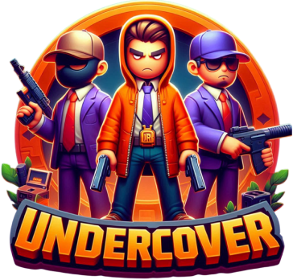

# Undercover



## Description

Welcome to **Undercover**! 🕵️‍♂️

Undercover is an interactive web application built with React, designed to offer an engaging gaming experience inspired by online board games. Whether you're a game enthusiast or simply looking for a new playful experience, Undercover provides a dynamic game where strategy and cooperation come together.

## Features

- 🎮 **Investigation Game**: Find out who the Undercovers are hiding among you.
- 🌐 **Real-Time Multiplayer**: Play in real-time with your friends.
- 📊 **Statistics and History (coming soon)**: Check detailed statistics and a history of your games.
- 📱 **Mobile Compatibility**: Enjoy the game on your smartphone and tablet with an interface designed for touch screens.

## Demo (coming soon)

[Try Undercover online!](.)

## Installation

To install and run Undercover locally, follow these steps:

1. **Clone the repository**:

   ```bash
   git clone https://github.com/landolsi-yanis/undercover-mobile.git
   ```

2. **Install dependencies**:

   ```bash
   npm install

   # or

   yarn install
   ```

3. **Start the development server**:

   ```bash
   npm start

   # or

   yarn start
   ```

4. **Access the application**:

   Open [http://localhost:3000](http://localhost:3000) in your browser.

## Usage

After starting the application, you can:

- **Create a Game**: Launch a new game and invite your friends to join.
- **Configure the Game**: Modify game settings to customize your experience.
- **Play**: Use the interactive features of the game to fully immerse yourself in the gameplay.

## Technologies Used

- **React**: JavaScript library for building the user interface.

## Author

Developed by [Yanis LANDOLSI](https://github.com/landolsi-yanis) – [Contact me via email](mailto:landolsiyanis@gmail.com)

## License

Distributed under the GNU AGPLv3 license
– see the [LICENSE](https://www.gnu.org/licenses/agpl-3.0.en.html) file for more information.

## Acknowledgments

A big thank you to NG and LP for their support and resources.
